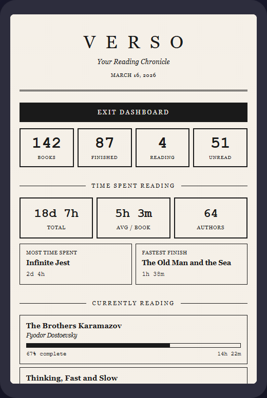
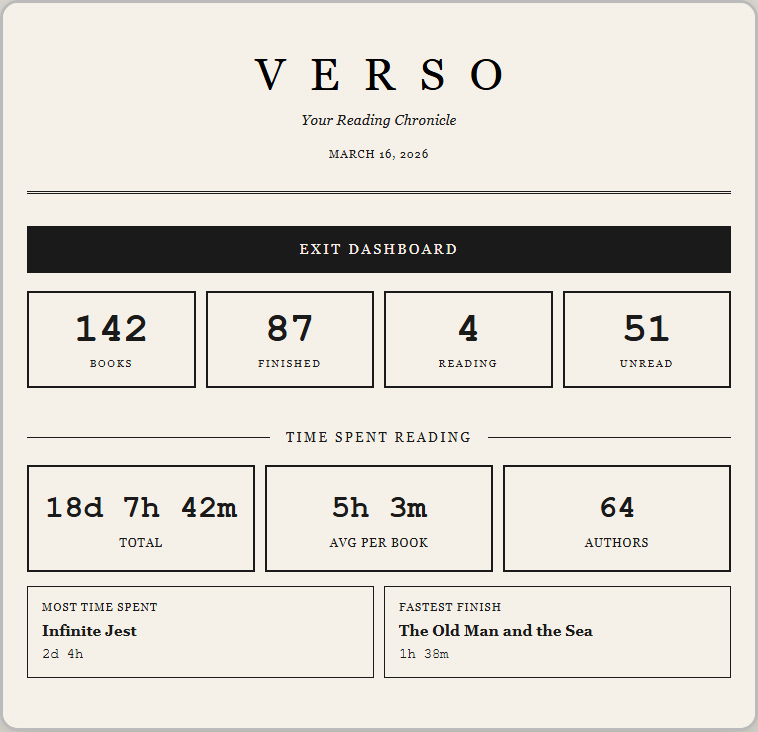
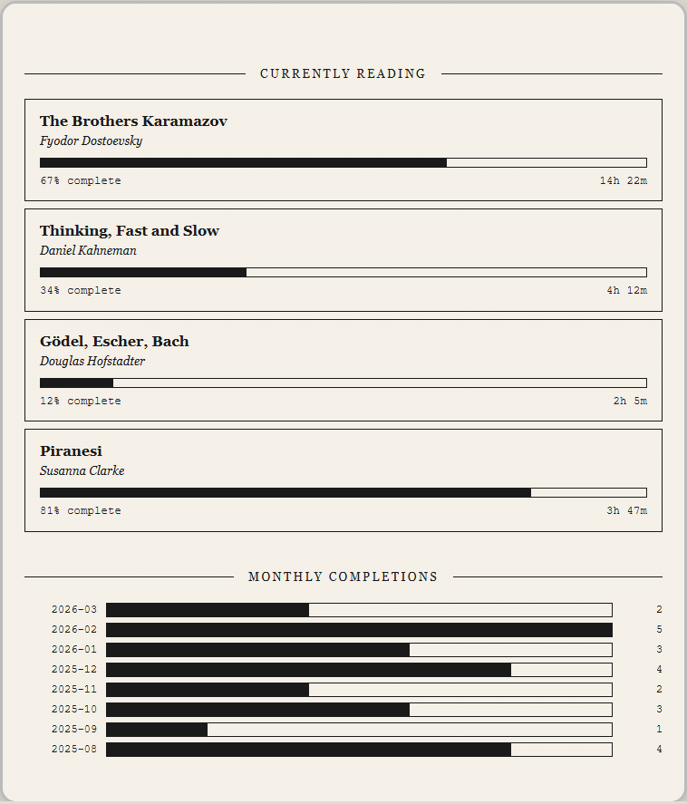
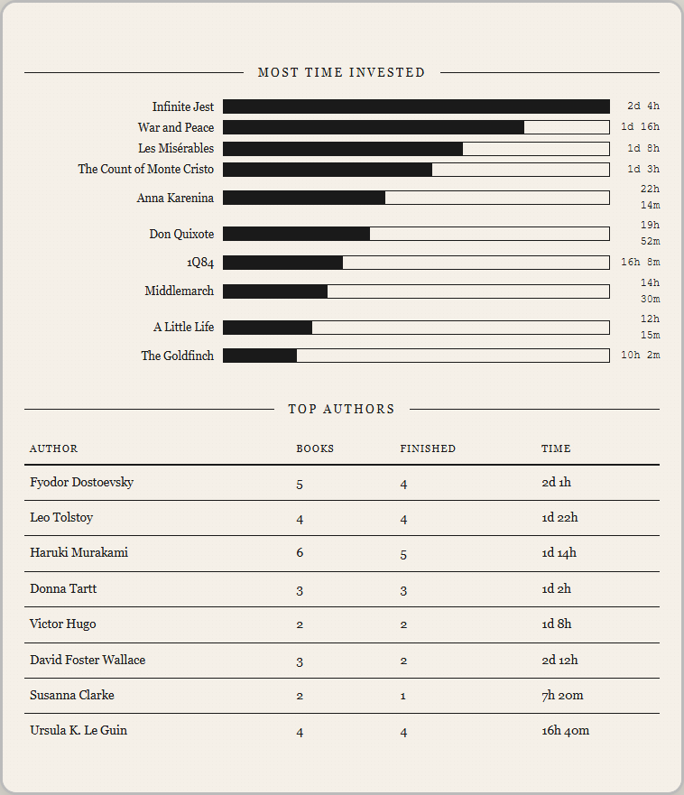
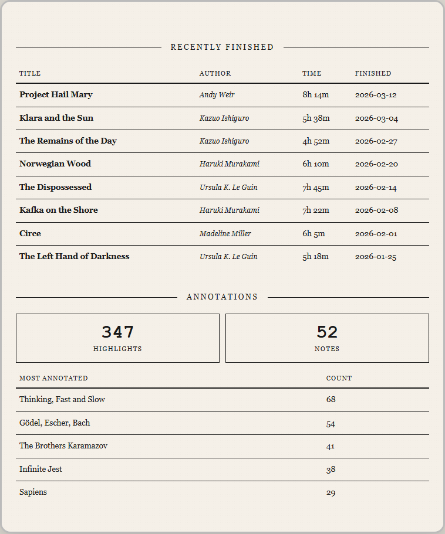
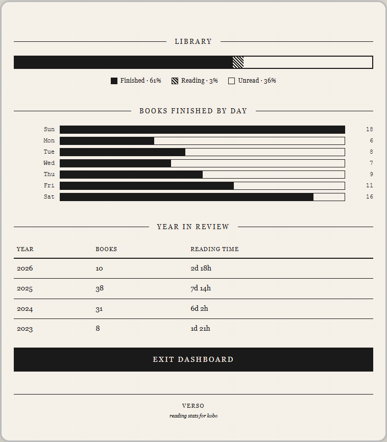

<div align="center">

# ▎V E R S O

**Your reading chronicle — a minimalist stats dashboard that runs entirely on your Kobo.**

Tap a button. See your stats. No internet. No cloud. No app.

---




</div>

## What It Does

Verso queries your Kobo's built-in SQLite database and generates a crisp, e-ink-optimized HTML dashboard — viewable right on your device through the built-in browser.

**One tap from the home menu. Zero dependencies to install. Fully offline.**

### Dashboard Sections

| Section | What You See |
|---------|-------------|
| **Library Overview** | Total books, finished, reading, unread |
| **Reading Time** | Total hours read, average per book, total authors |
| **Records** | Most time spent on a book, fastest finish |
| **Currently Reading** | Progress bars for each in-progress book |
| **Monthly Completions** | Bar chart of books finished per month |
| **Most Time Invested** | Top 10 books ranked by reading time |
| **Top Authors** | Ranked by total reading time |
| **Recently Finished** | Your last 15 completed books |
| **Annotations** | Highlight & note counts, most annotated books |
| **Library Composition** | Visual read / reading / unread breakdown |
| **Day-of-Week Patterns** | Which days you tend to finish books |
| **Year in Review** | Yearly books & reading time summary |

---

## Screenshots

<details>
<summary><b>Library Overview & Reading Time</b></summary>



</details>

<details>
<summary><b>Currently Reading & Monthly Completions</b></summary>



</details>

<details>
<summary><b>Most Time Invested & Top Authors</b></summary>



</details>

<details>
<summary><b>Recently Finished & Annotations</b></summary>



</details>

<details>
<summary><b>Library Composition & Year in Review</b></summary>



</details>

---

## Requirements

- A **Kobo e-reader** (tested on Libra BW — should work on any Kobo with firmware 4.x)
- **[NickelMenu](https://pgaskin.net/NickelMenu/)** installed

---

## Installation

### 1. Install NickelMenu (if you haven't)

Download [KoboRoot.tgz](https://github.com/pgaskin/NickelMenu/releases) and place it in `<Kobo>/.kobo/`. Eject and reboot. You should see a NickelMenu entry in the main menu.

### 2. Connect your Kobo via USB

It will appear as a drive (e.g., `E:\` on Windows, `/Volumes/KOBOeReader` on Mac).

> **Note:** `.adds` is a hidden folder. Enable **Show hidden files** in your file manager.

### 3. Copy files

Create the folders if they don't exist, then copy:

```
<Kobo>/.adds/verso/verso.sh        ← main script
<Kobo>/.adds/verso/sqlite3         ← bundled SQLite binary
<Kobo>/.adds/nm/verso              ← NickelMenu entry (no file extension!)
```

> **Important:** The NickelMenu config file must be named exactly `verso` — no `.nm` or other extension. Rename it when copying.

### 4. Eject & restart

Safely eject the Kobo. It will restart automatically. Done.

<details>
<summary><b>Windows example (E:\)</b></summary>

```
E:\.adds\verso\verso.sh
E:\.adds\verso\sqlite3
E:\.adds\nm\verso
```

</details>

<details>
<summary><b>Mac / Linux example</b></summary>

```bash
KOBO="/Volumes/KOBOeReader"  # or /media/your-user/KOBOeReader
mkdir -p "$KOBO/.adds/verso" "$KOBO/.adds/nm"
cp verso.sh "$KOBO/.adds/verso/"
cp sqlite3  "$KOBO/.adds/verso/"
cp verso.nm "$KOBO/.adds/nm/verso"
```

</details>

---

## Usage

1. From the Kobo home screen, tap the **menu** (☰ or three dots)
2. Tap **Verso**
3. The dashboard generates (~2 seconds) and opens in the browser
4. Scroll to explore your reading stats
5. Press back or close the browser to return to reading

Re-tap Verso anytime to refresh with your latest data.

---

## How It Works

```
┌─────────────┐     SQL queries     ┌──────────────────┐     generates     ┌────────────────┐
│ NickelMenu  │ ──────────────────▶ │  KoboReader.sqlite│ ──────────────▶ │  dashboard.html │
│ (menu tap)  │     via bundled     │  (Kobo's own DB)  │     styled for  │  (e-ink browser) │
└─────────────┘     sqlite3 CLI     └──────────────────┘     e-ink        └────────────────┘
```

- **`verso.sh`** — A POSIX shell script that runs SQL queries and generates a single HTML file
- **`sqlite3`** — A statically-compiled ARM binary (musl libc, ~858KB) bundled with Verso, since Kobo firmware doesn't include the `sqlite3` CLI
- **`KoboReader.sqlite`** — The database your Kobo already maintains with reading history, progress, bookmarks, and annotations

**No data leaves your device. No internet required. Everything runs locally.**

---

## File Structure

```
<Kobo>/
├── .adds/
│   ├── nm/
│   │   └── verso                ← NickelMenu menu entry
│   └── verso/
│       ├── verso.sh             ← main script
│       ├── sqlite3              ← bundled ARM binary
│       └── dashboard.html       ← generated on first run
└── .kobo/
    └── KoboReader.sqlite        ← Kobo's database (read-only)
```

---

## Troubleshooting

<details>
<summary><b>"Verso" doesn't appear in the menu</b></summary>

- Confirm [NickelMenu](https://pgaskin.net/NickelMenu/) is installed and working
- Check the file is at `.adds/nm/verso` — **no file extension**
- Restart the Kobo (hold power button ~10 seconds)

</details>

<details>
<summary><b>"Could not run process" error</b></summary>

- The NickelMenu config may have Windows line endings (CRLF). Open it in a code editor and save with **LF** line endings.
- Make sure the file is at `.adds/nm/verso` (not `verso.nm`)

</details>

<details>
<summary><b>Browser opens but shows an error page</b></summary>

- **"sqlite3 not found"** → Make sure `sqlite3` is in `.adds/verso/` alongside `verso.sh`
- **"Database not found"** → The Kobo database may be at a different path on your firmware version. [Open an issue.](../../issues)

</details>

<details>
<summary><b>All stats show 0</b></summary>

- You may not have read any books on this device yet
- Sideloaded books need to be opened at least once to register in the database

</details>

<details>
<summary><b>Browser opens but shows nothing / stale data</b></summary>

- The script may not have finished. Tap Verso again.
- Check that both `verso.sh` and `sqlite3` are in `.adds/verso/`

</details>

---

## Building the sqlite3 Binary

The included `sqlite3` binary is a statically-linked ARM (armhf) executable compiled with [musl libc](https://musl.libc.org/) for maximum portability. If you want to build it yourself:

```bash
# Using a musl ARM cross-compiler (e.g., from musl.cc)
wget https://musl.cc/arm-linux-musleabihf-cross.tgz
tar xf arm-linux-musleabihf-cross.tgz

# Download SQLite amalgamation
wget https://sqlite.org/2024/sqlite-autoconf-3450200.tar.gz
tar xf sqlite-autoconf-3450200.tar.gz
cd sqlite-autoconf-3450200

# Compile static binary
arm-linux-musleabihf-cross/bin/arm-linux-musleabihf-gcc \
  -Os -static \
  -DSQLITE_THREADSAFE=0 \
  -DSQLITE_OMIT_LOAD_EXTENSION \
  -DSQLITE_OMIT_READLINE \
  -o sqlite3 shell.c sqlite3.c

# Strip
arm-linux-musleabihf-cross/bin/arm-linux-musleabihf-strip sqlite3
```

---

## License

[MIT](LICENSE) — do whatever you want with it.

---

<div align="center">
<sub>Made for readers who like numbers as much as books.</sub>
</div>
